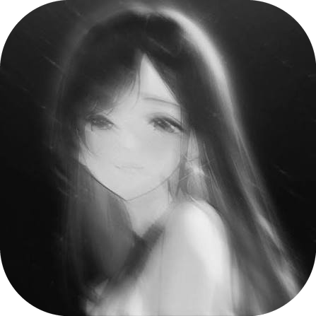

# P.blurr

### Automated On-Device Intimate Region Censoring for Android

 

**[📦 Download Latest Release](https://github.com/APPROX4/P.blurr/releases/latest)** • **[🛡️ Security Policy](SECURITY.md)**

---

## 📥 Download & Security Scan

| Resource | Details | Link |
| -------- | ------- | ---- |
| 📦 **Latest Release APK** | Android Application Package (v1.0.0) | [**Download APK**](https://github.com/APPROX4/P.blurr/releases/latest) |
| 🛡️ **VirusTotal Scan** | Verified 0/70 Clean (No Malware / Adware) | [**View VirusTotal Report**](https://github.com/APPROX4/P.blurr/releases/latest) |

---

## ✨ Features

- 🔒 **100% Offline Privacy**: Runs strictly local ONNX neural network inference. Zero data collection, zero network uploads.
- ⚡ **ONNX NudeNet Model**: Powered by official `nudenet.onnx` model for instant, high-precision intimate region detection.
- 🎯 **Targeted Region Masking**: Automatically censors exposed breasts, genitalia, and buttocks while keeping faces and backgrounds untouched.
- 🎨 **Pixelate & Blur Effects**: Easily toggle between pixel block censorship and smooth Gaussian blur.
- ✏️ **Manual Drawing Shape Tools**: Draw custom rectangular boxes, circles, freehand brush masks, or erase with live interactive canvas controls.
- 💎 **Pitch-Black UI**: Modern 60 FPS Compose design with white bloom glow animations.
- 🚀 **GitHub Release Updates**: Built-in update checker notifies you whenever a new release is published.

---

## 📱 Supported Devices

| Category | Requirement |
| -------- | ----------- |
| **Android Version** | Android 8.0 Oreo (`API 26`) up to Android 14 (`API 34`) & Android 15 |
| **Architectures** | `arm64-v8a`, `armeabi-v7a`, `x86_64`, `x86` |
| **System Memory** | 2 GB RAM minimum |
| **Formats** | JPEG, PNG, WEBP, HEIC, HEIF, BMP |
| **Internet** | Not required (100% Offline) |

---

## 🛠️ Tech Stack

- **Language**: Kotlin
- **UI Framework**: Jetpack Compose (Material 3)
- **AI Inference Engine**: ONNX Runtime Android SDK (`ai.onnxruntime:onnxruntime-android`)
- **Architecture**: Clean Architecture (Data, Domain, Presentation)

---

## 👤 Developer

Maintained and developed by **[APPROX](https://github.com/APPROX4)**.

- **GitHub Repository**: [APPROX4/P.blurr](https://github.com/APPROX4/P.blurr)
- **Developer Profile**: [@APPROX4](https://github.com/APPROX4)

---

## 📄 License

Licensed under the MIT License. See [LICENSE](LICENSE) for details.
